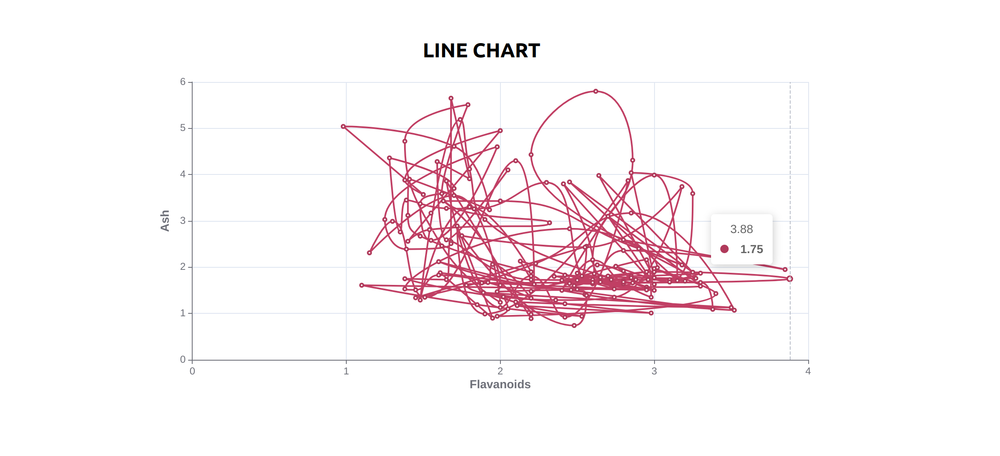
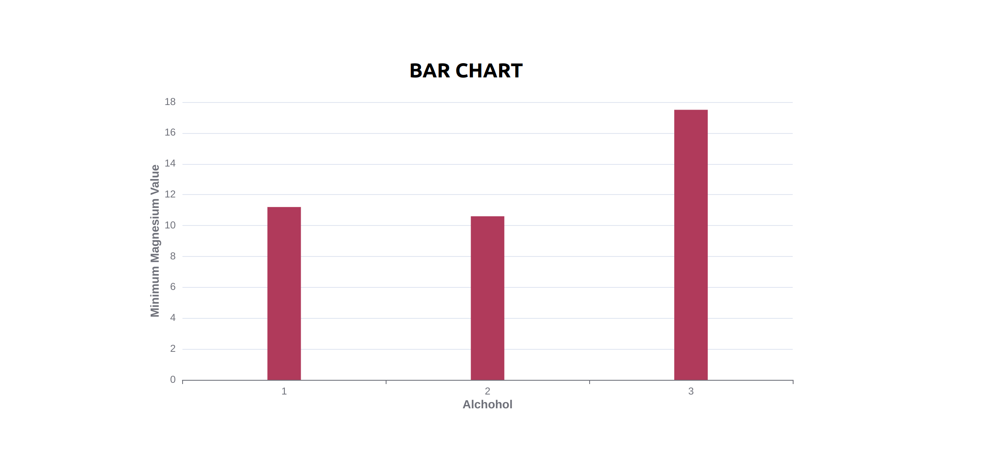

# Echart Project

It's a simple web app that uses ECharts to render and display various types of charts.

## Installation

To run this project locally, follow these steps:

1. **Clone the repository**:

 ```bash
   git clone https://github.com/rishabhverma54321/Echart.git
```

2. **Navigate to the project directory:**:
 ```bash
cd Echart
```

3. **Install dependencies:**:

Make sure you have Node.js and Yarn installed on your system.
 ```bash
yarn install
```

## Usage

1. **Start the development server:**:

 ```bash
yarn start
```

2. **View the project:**:

Open your browser and navigate to http://localhost:3000.

3. **Build for production:**:

To build the project for production, run:

 ```bash
yarn build
```
This will create an optimized production build in the build directory.

## Project Glimpses
1. **LINE CHART**:


2. **BAR CHART**:


To learn React, check out the [React documentation](https://reactjs.org/).
